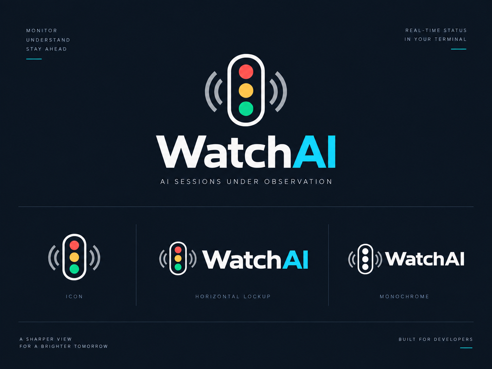
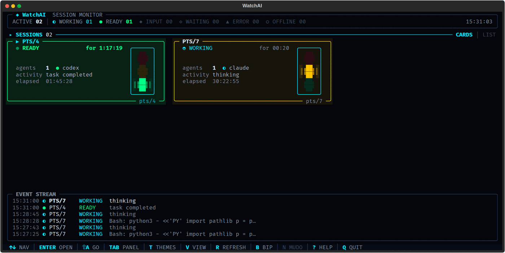
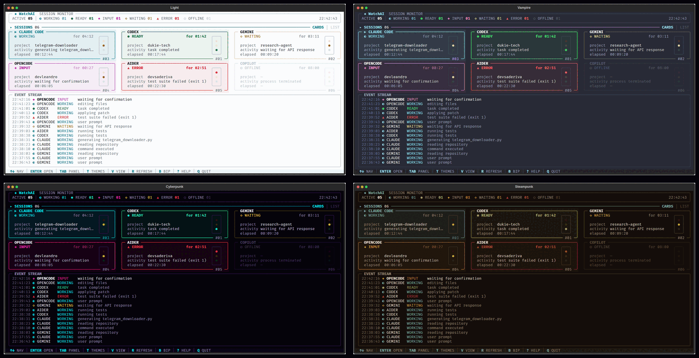

<div align="center">



**Monitor de sessões de IA no terminal.**
Claude Code, Codex, Gemini, OpenCode, Aider, Copilot — todas numa tela só.

[](https://github.com/LeandroDukievicz/WatchAI/actions/workflows/tests.yml)


[Conheça o projeto e veja como baixar](https://leandrodukievicz.github.io/WatchAI/)

</div>



---

> ### Detecção real, sem integrar nada
>
> O WatchAI **descobre sozinho** as sessões abertas na sua máquina: varre a
> tabela de processos e lê os diários que os próprios agentes já gravam no
> disco. Não há API, chave, hook, plugin nem configuração do agente — nada sai
> da sua máquina. Com `--mock` ele volta a rodar com dados simulados, para
> avaliar a interface sem depender do que está aberto.

## O problema

Você dispara uma tarefa no Claude Code, vai para outra janela enquanto ele
trabalha, e esquece. Dez minutos depois descobre que ele terminou em dois — ou
que travou esperando você confirmar um comando. Com três ou quatro sessões de IA
abertas ao mesmo tempo, o custo vira atenção fragmentada.

O WatchAI coloca todas numa tela só e responde de longe, sem leitura:
**quem está trabalhando, quem terminou e quem precisa de você.**

## Instalação

Requisitos: **Python 3.10+**, [pipx](https://pipx.pypa.io/stable/installation/),
Git e um terminal com Unicode. A única dependência além do Textual é o
[`psutil`](https://github.com/giampaolo/psutil), que lê a tabela de processos
igual nos três sistemas.

**O jeito mais curto, igual nos três sistemas:**

```bash
pipx install git+https://github.com/LeandroDukievicz/WatchAI.git
watchai
```

O `pipx` põe o WatchAI num ambiente isolado e o comando no PATH — sem mexer no
Python do sistema. Se o comando não aparecer logo após instalar, rode
`pipx ensurepath` e abra um terminal novo. Funciona em **Linux, macOS e
Windows**, e o CI verifica isso a cada commit: instala o pacote por `pipx` e
roda o comando nos três.

Enquanto o pacote ainda não está no PyPI, o comando acima instala a versão mais
recente diretamente deste repositório. Para atualizar ou remover:

```bash
pipx upgrade watchai
pipx uninstall watchai
```

**Para mexer no código:**

```bash
git clone https://github.com/LeandroDukievicz/WatchAI.git
cd WatchAI
python3 -m venv .venv && source .venv/bin/activate
pip install -e .
```

**Atalho no desktop Linux (opcional):** depois de clonar o repositório,
`./scripts/install-linux.sh --desktop` cria o venv, instala as dependências, põe
o comando `watchai` no PATH e cria o lançador no menu; com `--desktop`, também
na área de trabalho. Tudo fica em `~/.local`, sem `sudo`. Desfaz com
`./scripts/install-linux.sh --uninstall`. Esse script é uma alternativa para
integração com o desktop; a instalação comum nos três sistemas é a do `pipx`.

## Uso

```bash
watchai                 # detecção real
watchai --mock          # dados simulados, sem olhar seus processos
watchai --theme vampire # tema só desta execução
```

Dentro de um clone para desenvolvimento, `python main.py` e
`python -m watchai` são equivalentes ao comando instalado.

Truecolor (`COLORTERM=truecolor`) dá as cores exatas; sem ele o Textual aproxima
para 256/16 cores. Nada depende de ligatures — só símbolos Unicode simples
(`● ○ ◐ ◓ ◑ ◒ ◆ ◇ ▲ ▸ ▶ ─ │ ╭ ╮ ╰ ╯`). Testado com JetBrains Mono, Fira Code,
Cascadia, Hack, Meslo e Ubuntu Mono.

---

# Como ele descobre as sessões

**Um card por terminal.** Cada aba do terminal que tem (ou teve) um agente
rodando vira um card, e os agentes que rodam ali aparecem dentro dele — dois
agentes na mesma aba são um card com dois agentes, não dois cards.

A detecção tem duas camadas, e é a combinação que faz sentido:

| Camada | De onde vem | O que responde |
|---|---|---|
| **Processos** | varredura da tabela de processos (`psutil`), a cada 2 s | quem existe, em que terminal, desde quando — e se está gastando CPU. O `cwd` daqui é onde a sessão **abriu**, que serve de plano B para o projeto |
| **Diário** | o `.jsonl` que o próprio agente grava (`~/.claude/projects/…`, `~/.codex/sessions/…`) | **o que** ele está fazendo agora, se terminou ou se travou esperando você — e **em que projeto está**, que o processo não sabe quando o agente troca de pasta |

Nenhuma das duas sozinha resolve. O processo não distingue **READY** ("terminou,
é a sua vez") de **INPUT** ("parou esperando você confirmar"): nos dois casos
ele está dormindo com 0% de CPU. E o diário não sabe se o que ele registrou por
último ainda está acontecendo. Juntos:

```
última entrada do diário     +  processo     =  estado
─────────────────────────────────────────────────────────
texto do assistente             qualquer        READY     terminou
erro de API / limite            qualquer        ERROR     parou e não volta só
resultado de ferramenta         gastando CPU    WORKING   voltou a pensar
resultado de ferramenta         diário parado   WAITING   rodada em aberto
chamada de ferramenta           gastando CPU    WORKING   a ferramenta roda
chamada de ferramenta           parado há 8 s   INPUT     esperando VOCÊ
chamada de ferramenta           parado agora    WAITING   esperando algo externo
(sem diário legível)            gastando CPU    WORKING   mostra qual ferramenta
(sem diário legível)            parado          READY
```

O diário também diz **desde quando**: o `for MM:SS` do card conta a partir da
hora real da última mudança, não de quando o WatchAI abriu. Fechar e reabrir o
app não zera os contadores.

**ERROR não é ferramenta que falhou** — teste vermelho é trabalho normal. É a
sessão que parou e não volta sozinha: limite de uso atingido, token expirado,
erro de API.

Agentes sem diário conhecido funcionam pela camada de processos: aparecem,
mostram projeto e tempo, alternam entre WORKING e READY — e a atividade mostra
**a ferramenta que está rodando** (`running npm test`), lida do processo filho
que o agente abriu.

### Quem ele reconhece

| Agente | Comando | De onde vem o estado |
|---|---|---|
| **Claude Code** | `claude` | diário completo: ferramenta, fim de turno, erro de API |
| **Codex** | `codex` | diário completo: `task_started`, `task_complete`, aprovação, erro |
| **OpenCode** | `opencode` | leitor escrito a partir do layout do storage, **ainda não validado contra uma sessão real** — cai nos processos se o formato não bater |
| **Gemini CLI** | `gemini` | processos. O `logs.json` dele grava só as **suas** mensagens |
| **Antigravity** | `agy`, `antigravity` | processos. O CLI instala o executável como **`agy`** — é por esse nome que ele é reconhecido |
| **GitHub Copilot** | `copilot`, `gh copilot` | processos |
| **Grok** | `grok` | processos |
| **DeepSeek** | `deepseek` | processos |
| **Qwen Code** | `qwen` | processos |
| **Aider** | `aider` | processos |
| **Cursor** | `cursor-agent` | processos |
| **OpenHands** | `openhands` | processos |
| **Crush · Goose · Amp · Plandex · Continue** | `crush`, `goose`, `amp`, `plandex`, `continue` | processos |

Quem cai em "processos" aparece, mostra projeto, tempo e a ferramenta que está
rodando, e alterna entre WORKING e READY — falta só o "o que ele está pensando",
que exige um diário legível.

O reconhecimento é pelo **programa executado** (`argv[0]`, ou `argv[1]` quando
quem executa é um runtime como `node`, `npx`, `uvx` ou `python -m`), com o
caminho do pacote como segunda chance — é o que salva o Windows, onde tudo vira
`node.exe`. Nome solto no meio de um comando não conta: `ollama run deepseek-r1`
roda um modelo, não uma sessão, e `nvim grok.md` é um editor.

### Falta o seu? Acrescente sem esperar release

O ecossistema ganha CLI nova toda semana. No `~/.config/watchai/config.json`:

```json
{
  "agents": {
    "meu-agente": ["meuprog", "outro-nome"],
    "claude": ["claude-dev"]
  }
}
```

Chave nova cria um tipo; chave já conhecida vira apelido do mesmo agente. Vale
desde a primeira varredura da próxima abertura. E se for um agente conhecido,
mande um PR para a tabela — ela está em
[`providers/agents.py`](src/watchai/providers/agents.py).

## O que é multiplataforma e o que degrada

| Sinal | Linux | macOS | Windows |
|---|:--:|:--:|:--:|
| PID, linha de comando, início, CPU, filhos | ✅ | ✅ | ✅ |
| `cwd` (o projeto do card) | ✅ | ⚠️ processos seus | ✅ |
| diário local dos agentes | ✅ | ✅ | ✅ |
| tty como identidade do terminal | ✅ | ✅ | ❌ não existe |

Sem tty (Windows), a identidade do terminal passa a ser o **shell ancestral** —
que é o análogo certo, porque cada aba do Windows Terminal abre o seu próprio
shell. O reconhecimento de agente não depende do nome do processo: no Windows o
Claude Code é `node.exe`, e o que identifica é o programa executado ou o caminho
do pacote (`@anthropic-ai/claude-code`).

## Os limites, ditos na cara

- **Só os seus processos.** Sessões de outro usuário (ou dentro de um container)
  não aparecem.
- Agente **sem terminal** (rodando dentro de uma IDE) vira um card identificado
  pelo próprio processo — `antigravity #4312` — em vez de por uma tty.
- Dois agentes **do mesmo tipo no mesmo diretório** compartilham o diário mais
  recente; o segundo cai na camada de processos.
- O contador `for MM:SS` vem do diário quando existe; para agentes sem diário,
  ele conta a partir do momento em que o WatchAI viu o estado.
- INPUT é inferido, não lido: uma ferramenta lenta que não gasta CPU e não
  responde em 8 s aparece como INPUT.

---

# Funcionalidades

A tela tem quatro regiões fixas:

```
 ╭─ ◆ WatchAI  SESSION MONITOR ─────────────────────────────────╮
 │ ACTIVE 05 │ ◐ WORKING 01  ● READY 01  …         21:25:46     │   ① cabeçalho
 ╰──────────────────────────────────────────────────────────────╯
  ▸ SESSIONS 06 ─────────────────────────── CARDS │ LIST            ② título do painel
 ╭─ ▶ CLAUDE CODE ──────────────╮  ╭─ CODEX ───────────────────╮
 │  ◐ WORKING        for 04:12  │  │  ● READY       for 01:42  │    ③ painel SESSIONS
 ╰──────────────────────── #03 ─╯  ╰───────────────────── #01 ─╯
 ╭─ EVENT STREAM ───────────────────────────────────────────────╮
 │ 21:25:19 ◆ OPENCODE INPUT    waiting for confirmation        │   ④ event stream
 ╰──────────────────────────────────────────────────────────────╯
  ↑↓ NAV │ ENTER OPEN │ ⇧A GO │ TAB PANEL │ T THEMES │ V VIEW │ … ⑤ keybar
```

## ① Cabeçalho — resumo global

```
╭─ ◆ WatchAI  SESSION MONITOR ──────────────────────────────────────────────────╮
│ ACTIVE 05 │ ◐ WORKING 01  ● READY 01  ◆ INPUT 01  ◇ WAITING 01  ▲ ERROR 01  ○ OFFLINE 01   21:25:46 │
╰───────────────────────────────────────────────────────────────────────────────╯
```

- **ACTIVE** — quantas sessões não estão OFFLINE.
- **Um chip por estado**, em ordem fixa (WORKING, READY, INPUT, WAITING, ERROR,
  OFFLINE), para a posição não dançar quando os números mudam. Estado com zero
  fica apagado; com contagem, acende na cor do estado. Os que pedem você
  (READY, INPUT, ERROR) vêm em negrito.
- **STARTING só aparece quando existe** — é transitório demais para ocupar espaço fixo.
- **Relógio** à direita, atualizado a cada 0,5 s.
- O cabeçalho se adapta à largura: perde o subtítulo `SESSION MONITOR` abaixo de
  48 colunas, depois troca `◐ WORKING 01` por `◐ 1`, e em último caso abandona o
  relógio para manter os chips.

## ② Título do painel

```
 ▸ SESSIONS 06 ─────────────────────────────────────────── CARDS │ LIST
```

Mostra quantas sessões existem, qual visão está ativa (`CARDS` ou `LIST`, em
cyan) e — pelo `▸` e pela régua acesa — se o painel de sessões está em foco ou
se o foco está no EVENT STREAM (`TAB`).

## ③ Painel SESSIONS

### Visão CARDS (padrão)

```
╭─ ▶ DEVS-A-DERIVA ──────────────────────╮
│  ● READY             for 04:12  ╭───╮  │
│                                 │ ● │  │
│  agents   2  ● claude  ◐ codex  │ ● │  │
│  activity claude: task completed│ ● │  │
│  elapsed  03:14:19              ╰───╯  │
╰─────────────────────────────── pts/10 ─╯
```

| Elemento | O que é |
|---|---|
| Título na borda | O **caminho onde a aba está aberta** — `~`, `~/Projetos/WatchAI` —, segundo o diário do agente e não o `cwd` do processo: quem abre o agente na home e depois entra no projeto mantém o processo na home para sempre. Vale para toda aba, inclusive a que ficou na home. Caminho fundo demais é cortado pela esquerda (`…/CIENTISTA DE DADOS/Videos`), porque o que identifica está no fim. É relido a cada volta, então trocar de pasta troca o título. Ganha `▶` e vira cyan quando é o card selecionado |
| `pts/10` na borda | O terminal. No Windows, o shell (`pwsh #4312`) |
| `● READY` | Estado do terminal: o do agente que mais pede você (ERROR › INPUT › READY › WAITING › WORKING) |
| `for 04:12` | Há quanto tempo está **neste** estado (não é o tempo de sessão) |
| `agents` | Quantos agentes rodam ali e, em cada um, o símbolo na cor do **seu** estado |
| `activity` | O que o agente que decidiu o estado está fazendo (com o nome dele, quando há mais de um) |
| `elapsed` | Há quanto tempo o terminal está aberto |
| Semáforo | As 3 lâmpadas — ver [seção própria](#o-semáforo) |

- **O card inteiro veste a cor da lâmpada** — ele é o semáforo em tamanho
  grande, e é o que se lê do outro lado da sala: moldura e fundo em **verde**
  (READY), **vermelho** (ERROR) ou **âmbar** (WORKING, WAITING, STARTING e
  INPUT — os quatro estados da lâmpada amarela). OFFLINE não acende lâmpada
  nenhuma e fica neutro.
- **Selecionado** ganha fundo levemente mais claro e título cyan — mas a moldura
  **mantém a cor do estado**: um READY selecionado continua verde.
- Os estados dentro do âmbar continuam se distinguindo pelo **símbolo, pelo
  label e pela lâmpada**: só o INPUT pisca, e só ele e o ERROR deixam o
  contador em negrito depois de um minuto.
- **`for MM:SS` fica em negrito depois de 1 minuto** em READY, INPUT e ERROR — é
  o "terminou há dois minutos e você ainda não voltou".
- **Sessão sem agente é sessão encerrada.** Vale igual para a aba fechada e
  para o agente finalizado com a aba ainda aberta: o card monitora a **sessão de
  IA**, não o terminal — uma aba esquecida aberta não é notícia.
- **Ela não some na hora.** Fica 5 minutos como OFFLINE, depois troca a linha
  dos agentes por `⚠ removing in 01:59` e sai aos 7 — você precisa poder ver que
  a sessão terminou mesmo tendo saído da frente do computador. Passou disso, só
  ocupa espaço de quem está rodando.
- **Textos longos truncam com `…`**, nunca quebram linha.
- Se os cards não couberem na altura, o painel rola (`↑ ↓` seguem a seleção).

### Visão LIST (`V`)

```
   TERMINAL   STATUS      PROJECT                AGENTS              TIME
 ─────────────────────────────────────────────────────────────────────────
 ▶ pts/10     ● READY     devs-a-deriva          ● claude           04:12
   pts/6      ◐ WORKING   ninou-app              ◐ codex            01:42
   pts/3      ◆ INPUT     watchai                ◆ claude ● codex   00:27
   pts/2      ○ OFFLINE   —                      —                      —
```

A mesma informação em uma linha por sessão — é a visão mais densa, para quando
há muitas sessões. `TIME` é o mesmo contador dos cards (tempo no estado atual) e
segue a mesma regra de negrito. A linha inteira recebe a tinta do estado, e a
selecionada ganha `▶` e nome em cyan.

## ④ EVENT STREAM

```
╭─ EVENT STREAM ─────────────────────────────────────────────────────────╮
│ 21:25:19 ◆ OPENCODE INPUT    waiting for confirmation                  │
│ 21:24:26 ◐ OPENCODE WORKING  editing files                             │
│ 21:24:04 ● CODEX    READY    task completed                            │
│ 21:23:16 ◐ CODEX    WORKING  applying patch                            │
│ 21:22:55 ▲ AIDER    ERROR    test suite failed (exit 1)                │
╰────────────────────────────────────────────────────────────────────────╯
```

O histórico de todas as sessões junto, **mais novo em cima** (guarda os últimos
200 eventos). O evento mais recente vem em destaque; os demais, apagados.

**O histórico sobrevive ao fechamento**: o stream abre com o que aconteceu na
execução anterior (guardado em `~/.config/watchai/events.json`), porque o que
rodou enquanto você estava fora é justamente o que você não viu.

- **`TAB` move o foco para cá** — a borda acende em cyan e aparece `↑↓ scroll` no
  rodapé da caixa. Com o foco aqui, `↑ ↓` rolam o histórico em vez de trocar de
  sessão. Ao sair (`TAB` de novo) ele volta ao topo, para nunca ficar preso
  mostrando eventos velhos.
- **Cresce com o terminal**: ocupa toda a altura que sobra depois dos cards —
  quanto mais alto o terminal, mais histórico visível.
- **Encolhe por colunas**: abaixo de 56 colunas esconde a coluna de estado;
  abaixo de 34, também o nome da sessão, preservando hora e mensagem.

## ⑤ Keybar

```
 ↑↓ NAV │ ENTER OPEN │ ⇧A GO │ TAB PANEL │ T THEMES │ V VIEW │ R REFRESH │ B BIP │ N NOTIF │ ? HELP │ Q QUIT
```

Rodapé de atalhos que se adapta à largura: quando não cabe, descarta os itens
menos importantes primeiro (`N`, depois `B`, `R`, `T`, `TAB`…) e, em último caso,
mostra só as teclas sem descrição. A ordem de leitura não muda — só some item.
Os dois interruptores refletem o estado: `B BIP` / `B MUDO` para o som e
`N NOTIF` / `N MUDO` para a notificação, apagados quando desligados.

## Detalhes da sessão (`ENTER`)

```
╭─ SESSION DETAILS ──────────────────────────────────────────────────────╮
│  GEMINI                                                                │
│  STATUS     ◇ WAITING                    for 03:11  ·  since 21:22:46  │
│  SESSION    #02                                                        │
│  PID        190114                                                     │
│  PROJECT    research-agent                                             │
│  DIRECTORY  ~/research-agent                                           │
│  STARTED    21:16:37                                                   │
│  ELAPSED    00:09:20                                                   │
│                                                                        │
│  AGENTS                                                                │
│  claude     ● READY      pid 1150460   04:12  task completed           │
│  codex      ◐ WORKING    pid 1166198   00:27  Bash: npm test           │
│                                                                        │
│  CURRENT ACTIVITY                                                      │
│  waiting for API response                                              │
│                                                                        │
│  EVENTS                                                                │
│  21:22:46 ◇ waiting for API response                                   │
│  21:21:17 ◐ reading repository                                         │
│  21:19:57 ◐ user prompt                                                │
│                                                                        │
│  ESC back   ←→ prev/next session                                       │
╰────────────────────────────────────────────────────────────────────────╯
```

Modal com tudo sobre um terminal: além do estado (com o horário em que entrou
nele), **um bloco por agente** — PID, estado, há quanto tempo e o que está
fazendo —, o diretório, quando a aba abriu e os **últimos 4 eventos só dela**.

- O dashboard continua vivo atrás, escurecido — os semáforos e contadores seguem
  atualizando enquanto o modal está aberto.
- **`← →` trocam de sessão sem fechar**, circulando (depois da última volta para a
  primeira), e a seleção do dashboard acompanha.
- Sessão OFFLINE mostra `—` nos campos que perderam sentido.

## Ir para a janela da sessão (`⇧A`)

O card diz que o CLAUDE terminou; **`Shift+A`** põe na frente a janela do
terminal em que ele roda. É o fim natural do fluxo: ver, decidir, voltar. Funciona com o card
selecionado no dashboard ou com os detalhes abertos.

| Sistema | Como |
|---|---|
| **macOS** | `System Events`: escolhe a janela, zera o `AXMinimized` (janela na Dock não volta com `set frontmost`), levanta com `AXRaise` e confere se o app ficou na frente. Precisa da permissão de **Acessibilidade** — sem ela o `osascript` falha e o WatchAI diz isso |
| **Windows** | `AppActivate` do WScript.Shell, com `SW_RESTORE` antes para a janela minimizada e `GetForegroundWindow` depois para conferir. O código de saída do PowerShell não serve de resposta: é zero mesmo quando o `AppActivate` devolve `False` |
| **Linux/X11** | `wmctrl` ou `xdotool`; com várias janelas no mesmo processo (um servidor de terminal hospeda todas as abas), o diretório e o título da sessão desempatam |
| **Linux/Wayland** | o compositor **proíbe** um app levantar a janela de outro — é proteção contra roubo de foco, e do GNOME 50 em diante não há mais sessão X11 para escapar por ela. O caminho é a extensão **[Window Calls]**: com ela o WatchAI restaura a janela (`Unminimize`), ativa (`Activate`) e **confere** relendo o foco. Sem ela não há foco preciso no Wayland — e o WatchAI diz isso, em vez de tentar e fingir que deu |

[Window Calls]: https://extensions.gnome.org/extension/4724/window-calls/

No GNOME/Wayland é a extensão que liga o `⇧A` de verdade:

```bash
curl -L -o /tmp/window-calls.zip \
  "https://extensions.gnome.org/download-extension/window-calls@domandoman.xyz.shell-extension.zip?version_tag=69219"
gnome-extensions install --force /tmp/window-calls.zip
gnome-extensions enable window-calls@domandoman.xyz   # se reclamar, saia e entre na sessão
```

**Qual janela é a sessão.** Um servidor de terminal (gnome-terminal, konsole)
hospeda **todas** as janelas num processo só, então o PID não identifica janela
nenhuma — e o título também não: numa máquina real ele é de quem está rodando na
aba (o agente escreve o que está fazendo, um player escreve a música, o shell
escreve `usuário@host`). Quem identifica é a **tty**. Quando há mais de uma
janela candidata, o WatchAI escreve na tty da sessão um título único, pergunta à
lista quem ficou com ele e **devolve o título anterior**. Terminal que ignore o
OSC simplesmente não é encontrado por aí, e o desempate volta a ser por
diretório e nome.

Isso vale nos três sistemas — Window Calls, `wmctrl`, `xdotool` e AppleScript
listam janela e título do mesmo jeito. A exceção é o Windows, onde a sessão não
tem tty: ali o alvo é a janela principal do processo.

**E o sino.** Em qualquer Unix, o WatchAI também toca o bell **na tty da
sessão** — o terminal marca aquela aba como "precisa de atenção" e a janela
pisca na dock. No Wayland é o que resolve o que o `Activate` não resolve: ele
levanta a janela, o sino aponta a aba certa.

**Só é sucesso o que dá para conferir.** No Wayland o `Activate` devolve código
zero mesmo quando o compositor ignora o pedido: anunciar "janela à frente" ali
manda você procurar na tela o que não se moveu. Por isso o rodapé só diz
`window raised` depois de reler o foco da janela — e nos outros casos diz o que
de fato houve: `bell rung on pts/4…`, `the compositor refused to raise the
window`, `couldn't reach that window`.

## Ajuda (`?`)

Modal com a lista de teclas. Fecha com `ESC` ou `?`.

## O semáforo

Cada card carrega um semáforo de 3 lâmpadas — é a leitura "de longe", antes de
ler qualquer texto. É também a identidade do produto.

```
╭────────╮
│ ▗▟██▙▖ │  vermelha · ERROR
│ ██████ │
│ ▝▜██▛▘ │
│ ▗▟██▙▖ │  amarela  · WORKING, WAITING, STARTING e INPUT
│ ██████ │
│ ▝▜██▛▘ │
│ ▗▟██▙▖ │  verde    · READY
│ ██████ │
│ ▝▜██▛▘ │
╰────────╯
```

Cada lâmpada é um **octógono regular** de 6 células por 3 linhas, com os quatro
cantos cortados em diagonal. Em sub-células (cada caractere vale 2×2):

```
...######...
.##########.
############
############
.##########.
...######...
```

12 sub-colunas por 6 sub-linhas — e como a célula do terminal é ~2× mais alta
que larga, isso dá **6w × 6w**: um quadrado com cantos cortados de verdade. Com
2 linhas cabia só **um** degrau por canto, que o olho lê como entalhe, não como
lado do octógono. Em janelas apertadas entram as versões menores: a **pequena** (`●`, cinco
linhas) e, no limite, a **deitada** — as três lâmpadas numa linha só (`● ● ●`),
sem carcaça, porque nesse tamanho ela só roubaria colunas do nome.

É **o mesmo semáforo do ícone do app** ([`assets/watchai.svg`](assets/watchai.svg))
desenhado em texto: carcaça de contorno cyan, **sem fundo próprio** — o card
aparece através dela — e três lâmpadas.

**A lâmpada acesa é neon**, em três camadas do centro para fora: miolo na cor
cheia e em negrito; as pontas cortadas num tom intermediário (a borda difusa);
e o **fundo tingido dentro das próprias células de canto** — ali metade da
célula está vazia, que é o corte do octógono, e tingir esse vazio faz o halo
seguir a forma.

Tentei antes desenhar o halo com quadrantes ao lado da bola: o efeito foi o
contrário do pretendido, porque eles engrossavam a silhueta justamente onde o
octógono já é mais largo, e a forma virava uma cruz. Fundo não tem forma, então
ele brilha sem deformar.

Como num semáforo de verdade, as lâmpadas apagadas não somem: ficam num tom bem
escuro da própria cor. OFFLINE apaga as três e escurece a carcaça. INPUT é o
único que pisca (1 s aceso, 1 s apagado) — é o estado que depende de você.
Estreitando a janela, o semáforo é a **última** coisa a sair — é ele que dá o
estado sem texto nenhum (ver [Responsividade](#responsividade)).

## Os avisos (bip e notificação)

Quando uma sessão **entra** em READY, INPUT ou ERROR, o app avisa — a ideia é
você saber sem estar olhando. São os três estados que param o seu trabalho:
terminou, travou esperando você, quebrou.

**Um timbre por estado**, porque avisar os três com o mesmo som obrigaria você a
olhar a tela para saber qual foi. Cada um pega um som do tema do sistema; nada é
embutido no pacote.

**Notificação do sistema**, com o estado, o projeto e o terminal — **desligada
por padrão**: pop-up atravessa a sua tela, então quem decide se quer é você
(`N`). O bip avisa sem atrapalhar; a notificação é opcional.

Quando ligada, ela sai **só com o WatchAI fora de foco**: se você já está
olhando para ele, o pop-up é ruído. `notify-send` no Linux, `osascript` no macOS
e toast por PowerShell no Windows (este último, não verificado em máquina real).

**Cada um tem o seu interruptor**: `B` para o bip (começa **ligado**), `N` para
a notificação (começa **desligada**). As duas escolhas **ficam salvas** para as
próximas execuções.

O som sai pelo **servidor de som** (PipeWire/PulseAudio), não pelo bell do
terminal (`\a`). Essa escolha é o ponto todo: bell vira flash visual em vários
emuladores, costuma vir desligado e não ajuda com a aba em segundo plano. Um
stream de áudio normal toca independente de foco.

- `B` liga/desliga o som (`B BIP` / `B MUDO` no rodapé); religar confirma com um
  bip. `N` liga/desliga a notificação (`N NOTIF` / `N MUDO`).
- Uma rajada do **mesmo** aviso vira um bip só (janela de 1 s), sem enfileirar
  áudio. Mas READY seguido de ERROR são duas notícias diferentes: as duas tocam.
- Não avisa na abertura pelas sessões que já estavam lá — só pelo que muda
  depois que você abriu o WatchAI.
- No máximo 3 notificações por rodada: cinco sessões mudando juntas não viram
  cinco pop-ups.
- Ordem de preferência: `pw-play` → `paplay` → `ffplay`, tocando um bip do tema do
  sistema. Sem nenhum deles, tenta `canberra-gtk-play`; em último caso, o bell do terminal.
- Para mudar quais estados avisam, é o mapa `ALERT_SOUND`
  ([`src/watchai/app.py`](src/watchai/app.py)).

## Temas (`T`)

Oito paletas, trocáveis com o app rodando:

```
╭─ THEMES ─────────────────────────────────╮
│                                          │
│   ▶ WatchAI     ◐ ● ◆ ◇ ▲ ○ ◌  •         │
│     Light       ◐ ● ◆ ◇ ▲ ○ ◌            │
│     Dark        ◐ ● ◆ ◇ ▲ ○ ◌            │
│     Night Owl   ◐ ● ◆ ◇ ▲ ○ ◌            │
│     Vampire     ◐ ● ◆ ◇ ▲ ○ ◌            │
│     Cyberpunk   ◐ ● ◆ ◇ ▲ ○ ◌            │
│     Steampunk   ◐ ● ◆ ◇ ▲ ○ ◌            │
│     Grey        ◐ ● ◆ ◇ ▲ ○ ◌            │
│                                          │
│   ↑↓ preview   ENTER apply   ESC cancel  │
│                                          │
╰──────────────────────────────────────────╯
```

| Tema | O que é |
|---|---|
| **WatchAI** | o original: fundo quase preto e neon cyan/magenta (padrão) |
| **Light** | fundo claro, com contraste verificado: em tema claro, "apagado" tem que ser **mais escuro** que o fundo, e não mais claro (ver abaixo) |
| **Dark** | escuro neutro, sem neon |
| **Night Owl** | azul-petróleo com verdes suaves |
| **Vampire** | Dracula (o roxo `#BD93F9` entra como acento secundário) |
| **Cyberpunk** | preto arroxeado, cyan e magenta saturados |
| **Steampunk** | sépia e latão, com verdete no lugar do cyan |
| **Grey** | sem matiz nenhum: os estados se separam só por brilho |



- **Mover a seleção aplica o tema na hora** — o dashboard inteiro atrás do modal
  troca de cor, então dá para comparar antes de decidir. `ENTER` confirma,
  `ESC` desfaz e volta para o tema em que você estava.
- Cada linha mostra os símbolos dos estados **nas cores daquela paleta**; o `•`
  marca o tema em que você estava ao abrir.
- A escolha **fica salva** em `$XDG_CONFIG_HOME/watchai/config.json` (ou
  `~/.config/watchai/config.json`) e volta na próxima execução. Arquivo
  corrompido, disco cheio ou tema desconhecido caem no padrão, sem derrubar a TUI.
- O tema **não muda símbolo nem label** — só cor. O **Grey** é a prova: mesmo sem
  matiz nenhum, `◐ WORKING` e `▲ ERROR` continuam distinguíveis, que é a garantia
  de quem não enxerga cor.
- **Tema claro não é tema escuro invertido.** Apagar uma cor é misturá-la com o
  fundo: em fundo escuro isso escurece (e funciona), em fundo claro isso
  *clareia* e some. Por isso os níveis de apagado, tinta e borda dependem da
  polaridade da paleta — sem isso, no Light as bordas ficavam em 1,5:1 e as
  lâmpadas apagadas em 1,2:1, ou seja, invisíveis.

## Linguagem visual dos estados

Cor **e** símbolo **e** label — dá para ler sem depender só de cor.

| Estado | Símbolo | Cor | Semáforo | Significado | Card |
|---|---|---|---|---|---|
| READY | `●` (pulso lento) | verde | **verde** | terminou, pronta p/ nova instrução | card verde + label/tempo em negrito |
| WORKING | `◐◓◑◒` (giro lento) | cyan | **amarela** | executando | card âmbar |
| WAITING | `◇` | amarelo | **amarela** | esperando algo que não é você: um processo externo, ou o próprio modelo pensando | card âmbar |
| INPUT | `◆` (pulso lento) | magenta | **amarela piscando** | esperando ação do usuário | card âmbar + tempo em negrito |
| ERROR | `▲` (estático) | vermelho | **vermelha** | problema detectado | card vermelho |
| OFFLINE | `○` (apagado) | cinza escuro | todas apagadas | terminal fechado | quase some no fundo |
| STARTING | `◌ ○` | cyan secundário | **amarela** | acabou de iniciar | borda apagada |

Todas as animações são discretas e guiadas pelo mesmo relógio de 0,5 s: o giro do
WORKING, o pulso lento de READY e INPUT (~4,5 s por ciclo) e o `◌ ○` alternando do
STARTING. ERROR e OFFLINE são estáticos de propósito.

As cores da tabela são as do tema **WatchAI**; os outros temas remapeiam a cor de
cada estado, nunca o símbolo nem o label.

Regra de ouro da paleta: neon só em status, título, seleção e teclas. O resto é
branco suave e cinza.

## Navegação

| Tecla | Ação |
|---|---|
| `↑ ↓` (`k j`) | seleciona sessão — nas colunas do grid, move uma linha inteira |
| `← →` (`h l`) | navega entre cards da mesma linha (sem efeito com 1 coluna) |
| `ENTER` | abre os detalhes da sessão selecionada |
| `ESC` | volta / fecha o modal |
| `TAB` | alterna o painel **SESSIONS ⇄ EVENTS** |
| `⇧A` | põe na frente a janela do terminal onde a sessão roda |
| `T` | abre o seletor de temas (preview ao vivo; `ENTER` salva, `ESC` desfaz) |
| `V` | alterna **CARDS ⇄ LIST** |
| `R` | refresh — varre os processos na hora (no `--mock`, avança a simulação) |
| `B` | liga/desliga o bip |
| `N` | liga/desliga a notificação do sistema |
| `?` | ajuda |
| `Q` / `Ctrl+C` | sai |

Detalhes que o teclado respeita:

- Com o foco no **EVENT STREAM**, `↑ ↓` rolam o histórico e `ENTER` não abre nada —
  o painel de sessões volta com `TAB`.
- Descendo na **última linha incompleta** do grid, a seleção cai no último card em
  vez de não fazer nada.
- A seleção é sempre trazida para a área visível quando o painel rola.
- Dentro dos detalhes, `← →` trocam de sessão em vez de navegar no grid.

**Mouse:** clique seleciona (em card ou em linha da LIST), duplo clique abre os
detalhes.

## Responsividade

A janela encolhe em dois eixos, e cada um manda numa coisa. **A largura decide
quantas colunas** de cards cabem:

| Largura | Colunas |
|---|---|
| ≥ 130 | 3 |
| 90–129 | 2 |
| 60–89 | 1 |

**A altura decide o tamanho do card** — e isso não é detalhe: um card mais alto
que a área de sessões simplesmente não aparece, e o painel fica vazio. Por isso
o card desce em degraus, perdendo sempre o que é secundário:

| Formato | Quando | O que mostra |
|---|---|---|
| **full** (13 linhas) | área ≥ 13 | semáforo grande, estado, agentes, atividade, tempo |
| **short** (7) | área ≥ 7 | o mesmo texto, com o semáforo pequeno |
| **compact** (5) | área ≥ 5, ou largura < 60 | sem caixa: nome, projeto e semáforo pequeno |
| **micro** (1) | área < 5, ou largura < 34 | **uma linha**: o nome e as três lâmpadas deitadas (`● ● ●`) |

O que sobra no fim é o que se lê sem ler: **o semáforo e o nome**. O estado quem
dá são as lâmpadas — não precisa de texto —, e o resto continua a um `ENTER` de
distância, no modal de detalhes. No micro cabem quatro sessões num terminal de
12 linhas.

Por altura, a área de sessões encolhe até o conteúdo e o EVENT STREAM ocupa tudo
que sobra — quanto mais alto o terminal, mais histórico, e nunca um vão morto no
meio. Se as sessões não couberem, a área rola em vez de empurrar o stream para
fora: o stream nunca fica com menos que suas 6 linhas de eventos, e header e
keybar ficam sempre visíveis. Testado de 20×10 a 300×80.

## O modo simulado (`--mock`)

`python main.py --mock` troca a detecção por seis sessões de mentira: um
simulador muda o estado de uma delas a cada **5–12 s**, seguindo transições
plausíveis (de WORKING sai-se mais para READY do que para ERROR; de OFFLINE só
se volta por STARTING, que se resolve em ~4 s).

Serve para avaliar a interface em movimento sem depender do que está aberto na
sua máquina — e é sobre ele que roda boa parte da suíte de testes visuais. Aí o
card volta a ser uma IA, com `project` no lugar de `agents`. Fora do mock, `R`
força uma varredura na hora.

### Refazer as capturas

```bash
scripts/screenshot.py docs/screenshot.png              # sessões reais
scripts/screenshot.py --mock --temas docs/theme-shots  # um PNG por tema
```

Três armadilhas estão resolvidas dentro do script, e é por elas que ele existe:
o **`NO_COLOR`** do ambiente faz o Rich exportar em escala de cinza e os oito
temas saem idênticos (fácil de não perceber até a galeria estar no ar); o SVG do
Textual só é renderizado fielmente pelo **Chrome headless** — o ImageMagick
troca as fontes e o Inkscape empacotado como snap nem abre o arquivo; e a janela
do navegador é maior que o alvo de propósito, porque é o `-resize` para baixo
que deixa o texto nítido.

---

## Arquitetura

```
WatchAI/
├── main.py                      # entrada: python main.py
├── pyproject.toml               # pacote, deps e config do pytest
├── src/watchai/
│   ├── app.py                   # App: tema, tick (0,5 s), bindings, bip de READY
│   ├── theme.py                 # as 8 paletas + paleta ativa ($aw-* para o TCSS)
│   ├── layout.py                # breakpoints (LARGE/MEDIUM/SMALL/TINY) + teto da área
│   ├── format.py                # ellipsize, HH:MM:SS, mm:ss
│   ├── sound.py                 # bip: um timbre por estado, player do sistema
│   ├── notify.py                # notificação do sistema (libnotify/osascript/toast)
│   ├── focus.py                 # `G`: levanta a janela da sessão (e toca o sino)
│   ├── config.py                # preferências salvas (~/.config/watchai/config.json)
│   ├── models/                  # Status, Agent, Session (= terminal), SessionStore
│   ├── providers/               # ← a detecção real
│   │   ├── agents.py            # quem é agente (e quem só tem o nome parecido)
│   │   ├── source.py            # psutil: a única parte que conhece o SO
│   │   ├── transcript.py        # lê os .jsonl que os agentes já gravam
│   │   └── live.py              # reconcilia processos → terminais e agentes
│   ├── mock/sessions.py         # 6 sessões + MockSimulator (só no --mock)
│   ├── widgets/
│   │   ├── status_light.py      # StatusLight + render_status()  ← fonte única dos estados
│   │   ├── traffic_light.py     # TrafficLight (semáforo de 3 lâmpadas)
│   │   ├── session_card.py      # SessionCard (normal / compacto)
│   │   ├── session_row.py       # linha da visão LIST
│   │   ├── event_stream.py      # EVENT STREAM
│   │   ├── header.py            # cabeçalho + resumo global
│   │   ├── keybar.py            # rodapé de atalhos (responsivo)
│   │   └── panel_title.py       # "▸ SESSIONS 06 ─── CARDS │ LIST"
│   ├── screens/                 # dashboard.py · details.py · help.py · themes.py
│   └── styles/app.tcss          # todo o CSS
├── tests/                       # suíte headless (conftest silencia o áudio)
├── scripts/screenshot.py        # refaz as capturas do README e da landing
└── docs/                        # marca e screenshot
```

Três regras que o código segue:

1. **O estado mora no enum.** `Status` carrega label, cor, símbolo e prioridade de
   atenção. Nenhum widget hardcoda cor ou símbolo de estado — todos consultam o enum,
   e todo desenho de estado passa por `status_light.render_status()`.
2. **As cores moram no tema.** `theme.py` é a fonte única: o TCSS recebe as mesmas
   cores como variáveis `$aw-*` e quem desenha com Rich resolve a cor **na hora de
   renderizar** (`colors().cyan`), nunca no import — é isso que deixa trocar de
   tema com o app rodando.
3. **A UI só lê do store.** Os widgets reagem a dois reativos do app — `tick`
   (animação) e `version` (dados mudaram) — e nunca mexem no modelo.
4. **A varredura não mora na thread da UI.** `provider.read()` (≈50 ms de I/O)
   roda numa thread; `provider.apply()` mexe no store na thread da UI. Sem essa
   divisão, a animação engasgaria a cada ciclo.
5. **Nada de detecção pode derrubar a tela.** Varredura que falha vira leitura
   vazia, diário ilegível vira `None`, e o app segue com o que sabe.

## Testes

```bash
pip install -e ".[dev]"
pytest
```

67 testes headless (sem terminal real, **sem tocar áudio**, **sem notificar o sistema**, sem ler nem escrever
a sua config e **sem olhar os processos da máquina** — a tabela de processos é
injetada e o relógio é um argumento, então a suíte dá o mesmo resultado no seu
computador e no CI).

`tests/test_smoke.py` cobre a camada visual: breakpoints e navegação, troca de
visão/painel/modais, semáforo e piscar do INPUT, regras do bip, layout sem vão
morto e os temas (incluindo a checagem de que toda paleta fornece cada variável
`$aw-*` que o TCSS usa — uma faltando derruba a tela inteira).

`tests/test_providers.py` cobre a detecção: reconhecimento de agente (inclusive
o `node.exe` do Windows e o falso positivo de um plugin com "claude" no
caminho), a árvore de três processos do `codex` contando como um agente só, o
agrupamento por terminal, a prioridade de estado entre agentes, o ciclo
OFFLINE → aviso → remoção, os estados lidos do diário (terminou,
ferramenta pendente com processo parado = INPUT, com processo ocupado =
WORKING) a garantia de que diário corrompido ou varredura que explode não derrubam
nada, o tempo do estado vindo do diário (inclusive carimbo no futuro, que não
pode virar contador negativo), o erro de API virando ERROR, os avisos com
timbre por estado, a notificação que só sai com a janela fora de foco e o
histórico que sobrevive ao fechamento.

CI no GitHub Actions cobrindo Python 3.10, 3.11, 3.12, 3.13 e 3.14.

## Roadmap

O plano completo, com checkpoints, está em [MILESTONE.md](MILESTONE.md). O
resumo do que ainda não existe:

1. **Validar Windows e macOS na prática.** O código trata os dois e o CI roda a
   suíte nos três, mas ninguém abriu o app num Windows ou num Mac de verdade —
   é código testado, não software verificado.
2. **Confirmar o leitor do OpenCode** contra uma sessão real.
3. **Diário do Aider** (`.aider.chat.history.md`) — falta uma instalação para
   verificar o formato.
4. **Publicar no PyPI**, para instalar com `pipx install watchai` sem clonar.

## Licença

[MIT](LICENSE) © Leandro Dukievicz
